 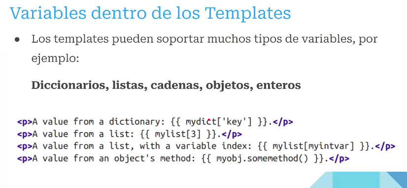

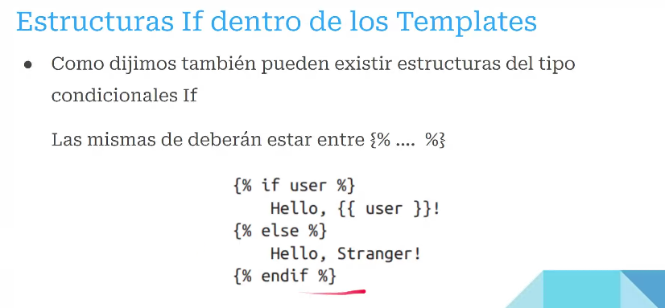

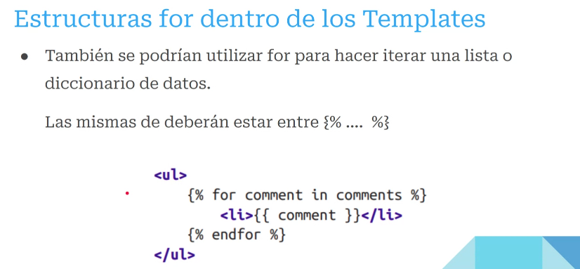

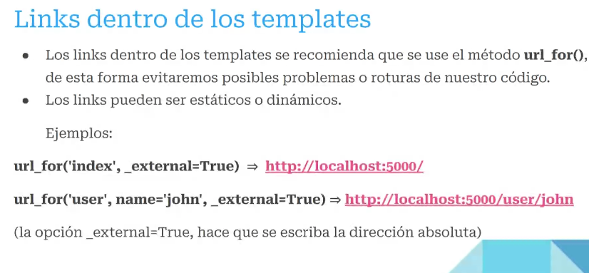
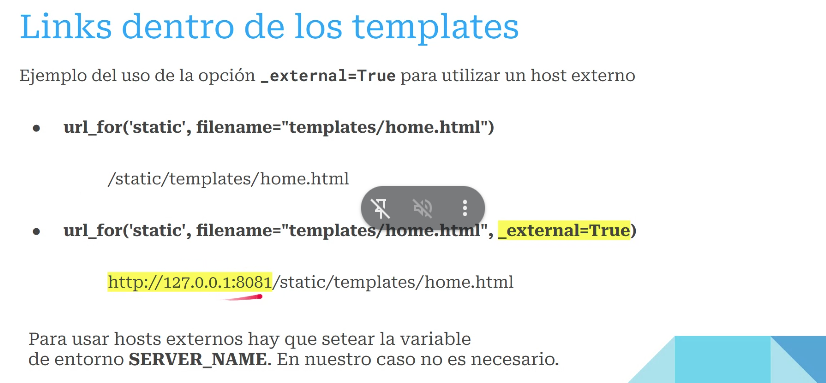
 HTML extendido
Etiquetas para htlm
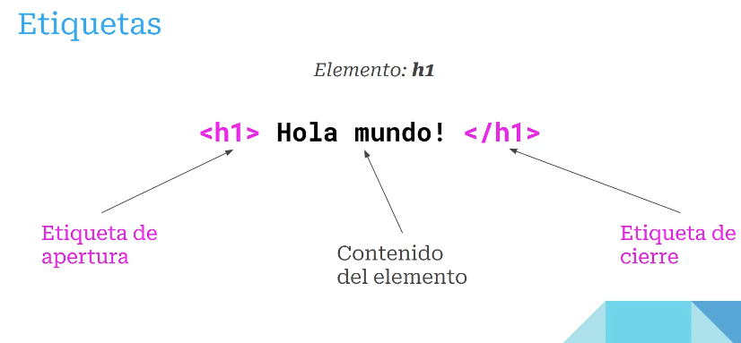
posdata: el doctype que se4 declara al principio es considerado una buena practica, pero no cambia el funcionamiento
etiquetas basicas: 
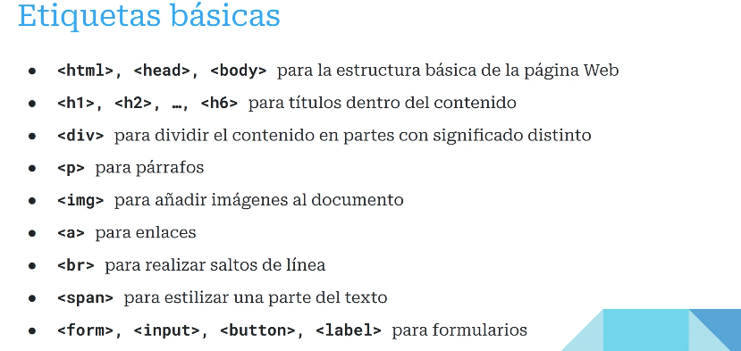
Es necesario poder reconocer como impacta el uso de las etiquetas en los "sectores" de la pagina y como reconocerlos.

atributos: 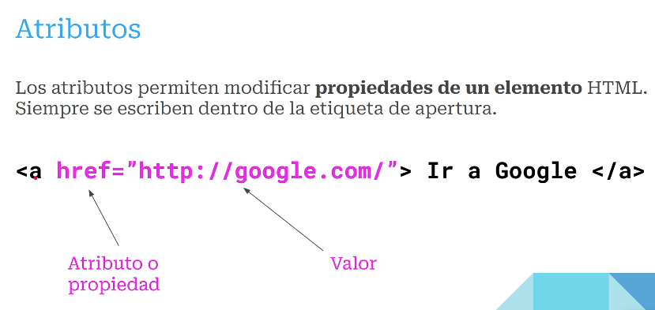

EJemplo basico 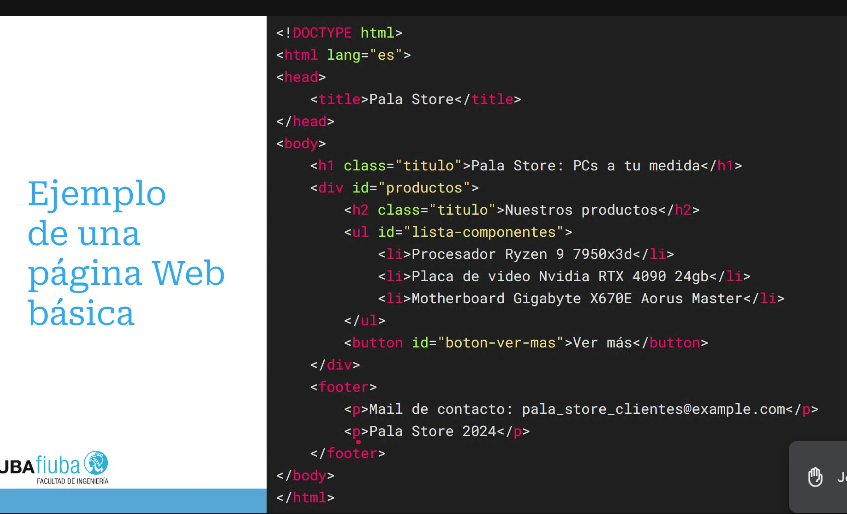

CSS 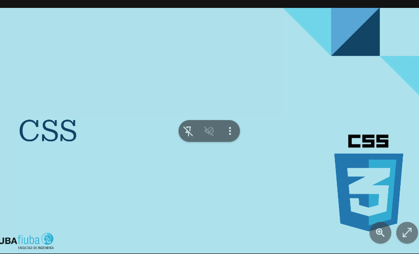

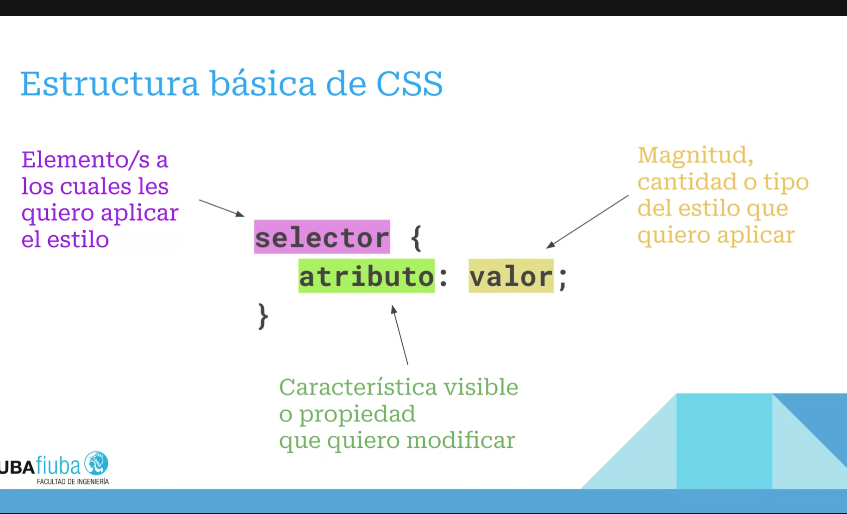

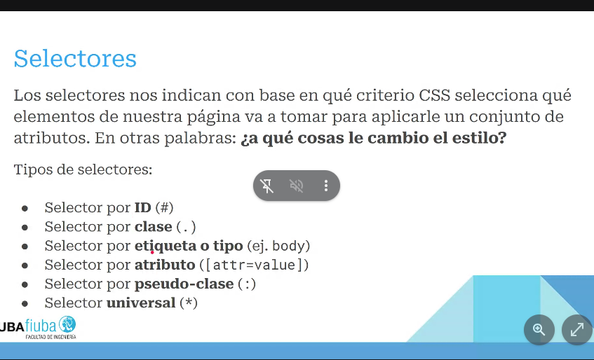
Diferencia entre id y clase: clase es para muchos, id es unico.
etiqueta y tipo para hacerlo mas global.

atributos: 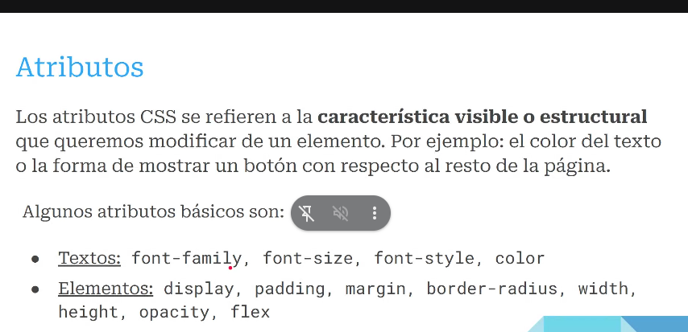

ejemplo basico: 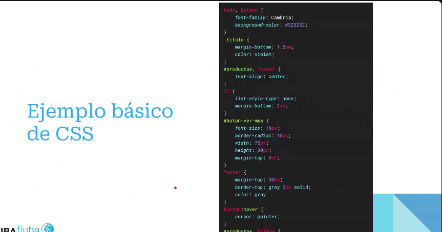
Buenas practicas: empezar a estilizar desde los elementos mas gfrandes a lo mas chicos, indentacion y tabeo comprensible, tener en cuenta que los estilos se pisan.

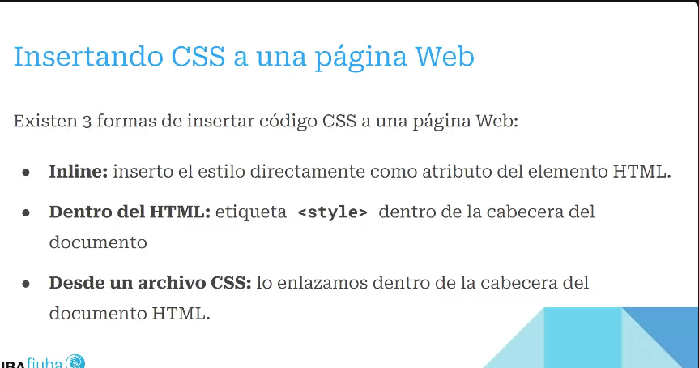

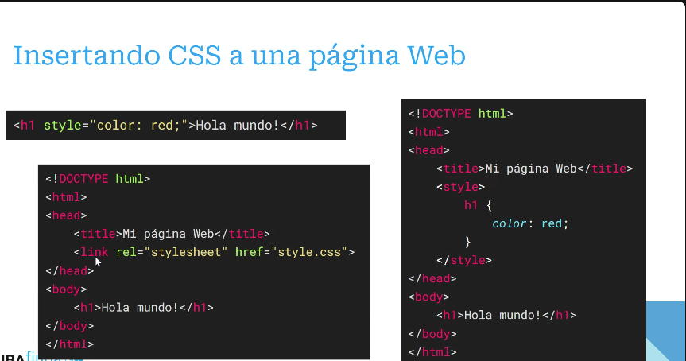
 Ejemplo con flask 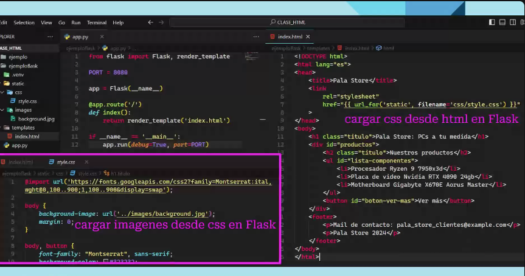